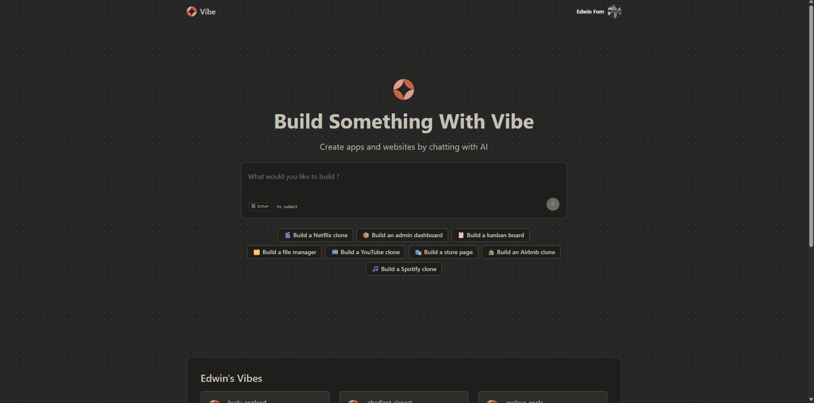

# Vibe

A lightweight clone of Lovable built to explore how AI-powered application generation works under the hood.

Vibe is an experimental platform that allows users to generate, edit, and execute code inside a controlled sandbox environment using natural language prompts.

---

## Overview

The goal of this project is not to replicate Lovable entirely, but to understand and rebuild its core mechanics:

- Prompt-driven code generation
- Secure code execution in an isolated environment
- Real-time interaction between user input and generated output
- Scalable fullstack architecture

This project is part of a broader exploration into AI-assisted development tools.

---

## Tech Stack

### Frontend
- Next.js 15 (App Router, Turbopack)
- React 19
- Tailwind CSS v4
- shadcn/ui and Radix UI
- React Hook Form with Zod validation

### Backend
- tRPC for end-to-end type-safe APIs
- Prisma ORM

### Infrastructure & Workflows
- Inngest for background jobs and event-driven workflows

### Authentication
- Clerk

### AI & Code Execution
- E2B Code Interpreter (Dockerized sandbox environment)
- Inngest Agent Kit

### Data Management
- TanStack React Query
- SuperJSON

---

## Features

- Prompt to code generation
- Interactive code editor running in a sandbox
- Secure execution environment using Docker
- Authentication and session management
- Background processing for AI workflows
- Modular and maintainable architecture

---

## Architecture

The system is built around a modern fullstack approach:

- The frontend communicates with the backend using tRPC
- AI-related tasks are processed asynchronously via Inngest
- Code execution is isolated using a Dockerized E2B sandbox
- Prisma handles database interactions
- Clerk manages authentication and user sessions

---

## Getting Started

```bash
git clone https://github.com/your-username/vibe.git
cd vibe

npm install

cp .env.example .env

npm run dev
